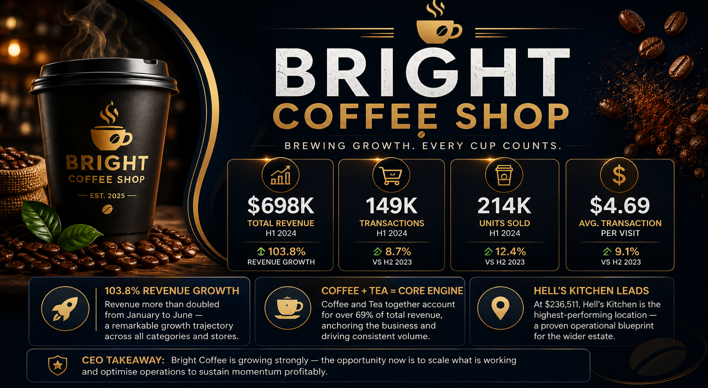

<h1 align="center">☕ Bright Coffee Shop Analytics</h1>

<p align="center">
  Turning Coffee Shop Data into Actionable Business Insights 📊
</p>

<p align="center">


</p>

---

## ☕ 30-Second Read

> **$698.8K in revenue. 149,116 transactions. 3 stores. 6 months. Growth accelerating in the back half.**
> This project finds exactly which hours, stores, and products are driving that growth — and where the business is leaving revenue on the table during its own busiest periods.

I took Bright Coffee Shop's raw transactional data and turned it into a full executive decision-support package — the same business story delivered five different ways (Excel, Power BI, Looker Studio, Lovable, and a CEO presentation) so any stakeholder can consume it in the format they trust most.

---

## 🏆 Executive Summary

| Metric | Result |
|---|---|
| 💰 Total Revenue | **$698.8K** |
| 🧾 Total Transactions | **149,116** |
| 🏪 Store Locations | **3** |
| 📅 Analysis Period | **Jan 2023 – Jun 2023 (6 months)** |
| 📈 Revenue Trend | **Accelerating** — stronger performance in later months |

**Key finding:** growth is real and broad-based rather than propped up by one location, but it is concentrated in specific hours, products, and categories — which means the business can act on it directly instead of waiting to see if growth continues.

---

## 💡 Key Insights

1. **Revenue is growing, and the growth is accelerating.** The back half of the analysis period outperformed the front half — a signal worth diagnosing and repeating, not just celebrating.
2. **No single store is carrying the business.** Performance across all three locations is relatively balanced, which de-risks the business but also means the strongest store's practices are a template the other two don't yet have.
3. **A small set of products drives disproportionate revenue.** Coffee and a handful of other categories are the clear commercial engine — the lever for inventory, promotions, and upselling decisions.
4. **Demand is concentrated in predictable peak hours**, especially busy morning periods — a scheduling and inventory problem as much as a sales one.
5. **The same data, told five ways, holds up.** Excel, Power BI, Looker Studio, Lovable, and the executive deck all point to the same conclusions — the insights aren't an artifact of one tool's view.

---

## 🚀 Strategic Recommendations

| # | Recommendation | Expected business impact |
|---|---|---|
| 1 | **Optimise peak-hour operations** — staff and stock ahead of the busiest purchasing windows | Fewer queues and lost sales during the highest-demand moments |
| 2 | **Protect and grow high-performing categories** — prioritise inventory and promotions on the strongest revenue drivers | Compounds the revenue the business already knows works |
| 3 | **Replicate the top-performing store's practices** across the other two locations | Raises the floor across the whole business, not just the ceiling |
| 4 | **Investigate what specifically drove the later-month growth** (demand, product mix, promotions, or operations) | Turns a one-off good trend into a repeatable playbook |
| 5 | **Use peak-traffic windows to upsell complementary products** | Increases average transaction value without needing more foot traffic |

**Bottom line for the business:** the growth is real, but right now it's something that happened rather than something being managed. Pinning it to specific hours, stores, and products turns it into a lever leadership can pull on purpose.

---

# 🔗 Explore the Project

| Deliverable               | Platform                    | Purpose                                               | Access                          |
| ------------------------- | --------------------------- | ----------------------------------------------------- | ------------------------------- |
| 📊 Executive Dashboard    | Microsoft Excel             | Interactive business performance analysis             | 📁 Available in this repository |
| 📈 BI Dashboard           | Power BI                    | Advanced interactive business intelligence            | 📁 Available in this repository |
| 🧱 Live Dashboard         | Databricks                  | Reproducible SQL-based analysis, hosted live           | 🔗 [Open dashboard](https://dbc-1f555e68-384c.cloud.databricks.com/sql/dashboardsv3/01f1a5262f76128bb7a308a4b96ac530?o=7474652278053184) |
| 🌐 Web Dashboard          | Looker Studio / Data Studio | Shareable web-based reporting                         | 🔗 `[Add your published Looker Studio link here]` |
| ✨ Analytics Experience    | Lovable                     | Modern interactive data storytelling                  | 🔗 [Open experience](https://lovable.dev/projects/0e0a00f1-39ee-45e5-916b-663caf9844ef) |
| 🎤 Executive Presentation | PowerPoint                  | Insights and strategic recommendations for leadership | 🔗 [Open presentation](https://acrobat.adobe.com/id/urn:aaid:sc:eu:ba9706c2-fb7e-43b4-85f4-d029711fc683) |
| 🗺️ Process Board          | Miro                         | Visual analytics workflow and planning board           | 🔗 [Open board](https://miro.com/app/board/uXjVHwtkLTs=/) |

> **One business problem → One dataset → One analytical story → Multiple decision-making tools**

---

# 📑 Table of Contents

* [☕ 30-Second Read](#-30-second-read)
* [🏆 Executive Summary](#-executive-summary)
* [💡 Key Insights](#-key-insights)
* [🚀 Strategic Recommendations](#-strategic-recommendations)
* [🔗 Explore the Project](#-explore-the-project)
* [📊 Project Overview](#-project-overview)
* [🎯 Business Problem](#-business-problem)
* [🎯 Executive Decision Support](#-executive-decision-support)
* [📂 Dataset Overview](#-dataset-overview)
* [🛠️ Tools & Technologies](#️-tools--technologies)
* [🔍 Analytics Workflow](#-analytics-workflow)
* [🌐 Dashboard & Deliverables Portfolio](#-dashboard--deliverables-portfolio)
* [📈 From Data to Decision](#-from-data-to-decision)
* [📁 Project Structure](#-project-structure)
* [🧠 Skills Demonstrated](#-skills-demonstrated)
* [🔮 Future Improvements](#-future-improvements)
* [👩‍💻 About the Analyst](#-about-the-analyst)

---

# 📊 Project Overview

Bright Coffee Shop Analytics is an **end-to-end data analytics project** that analyses transactional sales data to understand business performance, identify key revenue drivers, and provide actionable recommendations for executive decision-making.

The project demonstrates the complete data analytics journey—from understanding the business problem and exploring the data to analysing performance, building interactive dashboards, and communicating findings to senior stakeholders.

Rather than creating a single dashboard, this project presents the analysis through multiple professional deliverables:

📊 **Excel Dashboard** | 📈 **Power BI Dashboard** | 🌐 **Looker Studio Dashboard** | ✨ **Lovable Analytics Experience** | 🎤 **CEO Executive Presentation**

---

# 🎯 Business Problem

Bright Coffee Shop needs to understand its sales performance and the key factors driving business growth.

The analysis was designed to answer important business questions, including:

* 💰 How much revenue is the business generating?
* 📈 How is business performance changing over time?
* 🏪 Which store locations are performing best?
* ☕ Which products and categories are the strongest revenue drivers?
* 🕒 When are the busiest customer purchasing periods?
* 📦 Where are the opportunities to improve operational efficiency and revenue?

The goal is not simply to report historical numbers, but to transform data into insights that can support **better business decisions**.

---

# 🎯 Executive Decision Support

The CEO and leadership team require a clear understanding of overall business performance and the factors influencing revenue growth.

This project supports executive decision-making by translating transactional data into meaningful insights and recommendations.

The analysis focuses on three key areas:

### 1️⃣ Business Performance

Understanding overall revenue, sales volume, and performance trends.

### 2️⃣ Business Drivers

Identifying the stores, products, categories, and customer behaviours contributing to performance.

### 3️⃣ Business Actions

Turning analytical findings into practical recommendations for improving growth and operational efficiency.

> **The CEO is the primary stakeholder—not a separate analytics project.** The dashboards and presentation are different ways of communicating the same analytical story.

---

# 📂 Dataset Overview

The dataset contains transactional sales information from Bright Coffee Shop.

### Dataset Summary

* 📊 **149,116 transactions**
* 📅 **Analysis period: January 2023 – June 2023**
* 🏪 **3 store locations**
* ☕ **Multiple product types and categories**
* 📈 Sales, revenue, product, store, and time-based data

### Key Data Fields

| Field            | Description                            |
| ---------------- | -------------------------------------- |
| Transaction ID   | Unique identifier for each transaction |
| Transaction Date | Date of purchase                       |
| Month            | Month of transaction                   |
| Day Name         | Day of the week                        |
| Store Location   | Coffee shop location                   |
| Product          | Product purchased                      |
| Product Category | Product grouping                       |
| Quantity         | Units purchased                        |
| Revenue          | Sales revenue generated                |
| Transaction Time | Time of purchase                       |
| Hour             | Hourly purchasing pattern              |
| Time Interval    | Customer demand by time period         |

The dataset provides sufficient detail to analyse performance across **time, location, product, and customer purchasing behaviour**.

---

# 🛠️ Tools & Technologies

This project demonstrates the ability to work across multiple analytics and business intelligence platforms.

| Tool               | Purpose                                                                  |
| ------------------ | ------------------------------------------------------------------------ |
| 🟢 Microsoft Excel | Data preparation, analysis, PivotTables, KPIs, and dashboard development |
| 🔵 SQL             | Data exploration, querying, and business analysis                        |
| 🟡 Power BI        | Interactive business intelligence reporting                              |
| 🌐 Looker Studio   | Web-based dashboarding and stakeholder reporting                         |
| ✨ Lovable          | Modern interactive analytics and data storytelling                      |
| 🎤 PowerPoint      | Executive communication and presentation of recommendations              |
| 🐙 GitHub          | Project documentation and portfolio management                           |

---

# 🔍 Analytics Workflow

This project followed a structured data analytics process:

### 1️⃣ Define the Business Problem

Understand the questions and decisions that the business and executive team need to address.

⬇️

### 2️⃣ Understand & Prepare the Data

Review the dataset, identify relevant fields, check data quality, and prepare the data for analysis.

⬇️

### 3️⃣ Explore the Data

Analyse revenue, sales volume, stores, products, categories, and time-based customer behaviour.

⬇️

### 4️⃣ Identify Insights

Look beyond the numbers to identify trends, patterns, opportunities, and potential business risks.

⬇️

### 5️⃣ Build Interactive Dashboards

Develop dashboards using multiple platforms to make insights accessible to different stakeholders.

⬇️

### 6️⃣ Communicate Recommendations

Present the findings through executive storytelling and actionable recommendations.

---

# 🌐 Dashboard & Deliverables Portfolio

The same Bright Coffee business case was communicated through multiple analytical deliverables. Each platform serves a different purpose while supporting the same business questions.

## 📊 Microsoft Excel Dashboard

The Excel dashboard provides an interactive view of business performance using KPI cards, PivotTables, charts, and filters.

### Key Analysis Areas

* Total Revenue and Sales KPIs
* Monthly Revenue Trends
* Store Performance
* Product and Category Performance
* Customer Purchasing Patterns
* Peak Sales Periods

🎯 **Best for:** Accessible business reporting and exploratory analysis.

📁 **Location:** `Excel_Dashboard/`

---

## 📈 Power BI Dashboard

The Power BI dashboard provides a more advanced and interactive business intelligence experience.

### Key Features

* Interactive filtering
* Dynamic KPIs
* Drill-down analysis
* Store and product comparisons
* Trend analysis
* Executive reporting views

🎯 **Best for:** Interactive business intelligence and deeper stakeholder exploration.

📁 **Location:** `PowerBI_Dashboard/`

---

## 🌐 Looker Studio Dashboard

The Looker Studio dashboard provides a shareable, web-based reporting experience for exploring business performance.

### Key Features

* Interactive reporting
* Web-based access
* Dynamic filters
* Performance monitoring
* Stakeholder-friendly visualisations

🎯 **Best for:** Sharing insights with stakeholders through the web.

🔗 **Live Dashboard:** see the [Explore the Project](#-explore-the-project) table above.

---

## ✨ Lovable Analytics Experience

The Lovable dashboard demonstrates how data analytics can be combined with modern application design and intuitive user experiences.

### Key Features

* Modern dashboard interface
* Interactive data exploration
* Executive-focused storytelling
* User-friendly navigation
* Insight-driven design

🎯 **Best for:** Demonstrating data storytelling, analytics thinking, and modern digital product skills.

🔗 **Live Dashboard:** see the [Explore the Project](#-explore-the-project) table above.

---

## 🎤 CEO Executive Presentation

The CEO presentation brings the analytical findings together into a concise executive narrative.

The presentation focuses on:

* Overall business performance
* Revenue and growth trends
* Key business drivers
* Store and product performance
* Opportunities and risks
* Strategic recommendations
* Recommended next actions

🎯 **Best for:** Executive communication and data-driven decision-making.

📁 **Location:** `Presentation/`

---

# 📈 From Data to Decision

This project demonstrates the complete journey from raw data to executive decision-making:

```text
                    ┌──────────────────────┐
                    │       RAW DATA       │
                    │ Bright Coffee Sales  │
                    └──────────┬───────────┘
                               │
                               ▼
                    ┌──────────────────────┐
                    │   DATA PREPARATION   │
                    │ Cleaning & Validation│
                    └──────────┬───────────┘
                               │
                               ▼
                    ┌──────────────────────┐
                    │   DATA ANALYSIS      │
                    │ SQL • Excel • EDA    │
                    └──────────┬───────────┘
                               │
                               ▼
        ┌──────────────────────┼──────────────────────┐
        ▼                      ▼                      ▼
   📊 EXCEL               📈 POWER BI            🌐 LOOKER
   Dashboard               Dashboard              Studio
        │                      │                      │
        └──────────────────────┼──────────────────────┘
                               │
                               ▼
                    ┌──────────────────────┐
                    │   ✨ LOVABLE APP     │
                    │ Interactive Analytics│
                    └──────────┬───────────┘
                               │
                               ▼
                    ┌──────────────────────┐
                    │ 🎤 EXECUTIVE STORY   │
                    │ Presentation & Action│
                    └──────────────────────┘
```

> **The objective is not simply to build dashboards—it is to transform data into insights and insights into better decisions.**

---

# 📁 Project Structure

```text
Bright-Coffee-Shop-Analytics/
│
├── README.md
│
├── Data/
│   └── Bright_Coffee_Dataset.xlsx
│
├── Excel_Dashboard/
│   └── Bright_Coffee_CEO_Dashboard.xlsx
│
├── PowerBI_Dashboard/
│   └── Bright_Coffee_Dashboard.pbix
│
├── Looker_Studio/
│   └── Dashboard_Link.txt
│
├── Lovable_Dashboard/
│   └── Dashboard_Link.txt
│
├── Presentation/
│   └── Bright_Coffee_Executive_Presentation.pptx
│
├── SQL/
│   └── Bright_Coffee_Analysis.sql
│
└── Images/
    ├── Excel_Dashboard.png
    ├── PowerBI_Dashboard.png
    ├── Looker_Studio_Dashboard.png
    └── Lovable_Dashboard.png
```

> 📌 The folder names can be adjusted to match the exact files in your GitHub repository.

---

# 🧠 Skills Demonstrated

This project demonstrates practical skills across the complete data analytics lifecycle.

### 📊 Data Analysis

* Exploratory Data Analysis (EDA)
* Trend Analysis
* Revenue Analysis
* Product Performance Analysis
* Store Performance Analysis
* Time-Based Analysis

### 📈 Data Visualisation

* Dashboard Design
* KPI Development
* Interactive Reporting
* Data Storytelling
* Executive Reporting

### 💼 Business Skills

* Translating Business Problems into Analytical Questions
* Identifying Business Drivers
* Developing Data-Driven Recommendations
* Executive Communication
* Stakeholder-Focused Analysis

---

# 🔮 Future Improvements

Future versions of this project could include:

* 🔄 Automated data refreshes
* 📈 Sales forecasting
* 👥 Customer segmentation
* 💰 Profit and margin analysis
* 📦 Inventory optimisation
* 🏪 Advanced store benchmarking
* 🤖 Predictive analytics
* ☁️ Cloud-based data pipelines

---

# 👩‍💻 About the Analyst

I am building a practical data analytics portfolio focused on transforming complex datasets into clear, actionable business insights.

This project demonstrates my ability to:

> **Understand the business problem → Analyse the data → Build dashboards → Generate insights → Communicate recommendations**

I am passionate about using **data, analytics, and technology** to help organisations make smarter decisions.

---

## ⭐ If You Found This Project Interesting

If you found this project useful or interesting, feel free to explore the dashboards and project files.

⭐ **Thank you for visiting my Bright Coffee Shop Analytics project!**

---
